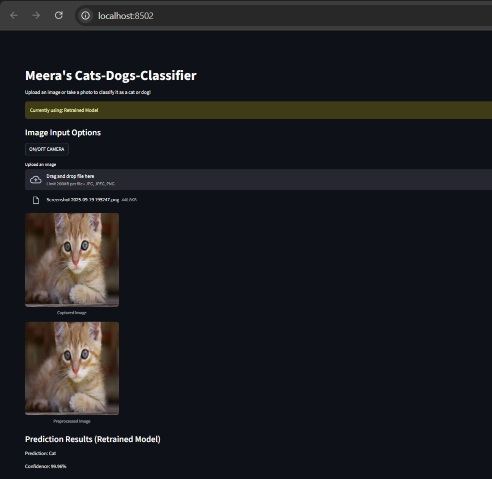
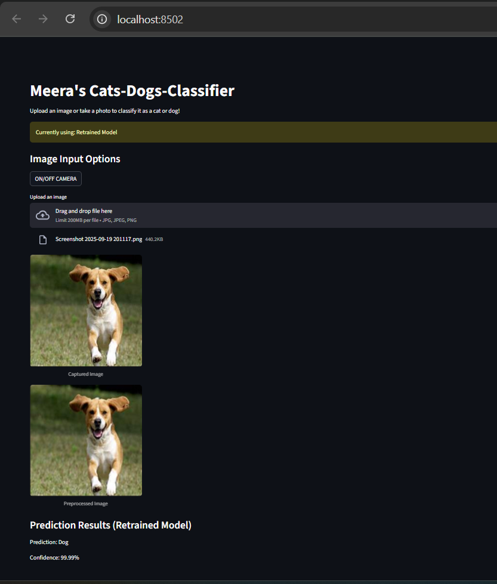
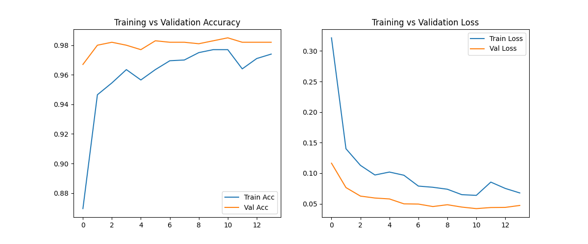

# Meera's Cats-Dogs-Classifier

This project is a web application built with **Streamlit** that classifies images as either a **cat** or a **dog**. The application uses a pre-trained **TensorFlow/Keras** deep learning model and includes a unique feature that allows users to retrain the model with new data on the fly.

---

### Features

* [cite_start]**Image Classification:** Upload an image or use your device's camera to predict if the image contains a cat or a dog[cite: 1].
    * **Cat Prediction Example:** 
    * **Dog Prediction Example:** 
* [cite_start]**Live Retraining:** Retrain the model using a ZIP file containing new cat and dog images, which improves the model's accuracy and adaptability[cite: 1].
* [cite_start]**Performance Metrics:** View real-time performance statistics, including accuracy and loss, after retraining the model[cite: 1].
    * **Training Curves:** 
* [cite_start]**Interactive UI:** A user-friendly interface built with Streamlit for a seamless experience[cite: 1].

---

### Project Structure

* [cite_start]`app.py`: The main Python script that runs the Streamlit web application[cite: 1].
* `requirements.txt`: Lists all the necessary Python libraries to run the application.
* [cite_start]`final_image_classifier.keras`: The pre-trained deep learning model used for initial predictions[cite: 1].
* [cite_start]`training_curves.png`: A plot showing the model's training and validation accuracy and loss over time[cite: 1].
* `PROJECT.ipynb`: A Jupyter Notebook containing the code used to train and evaluate the initial model.

---

### Installation

1.  **Clone the repository:**
    ```bash
    git clone <repository_url>
    cd <repository_name>
    ```
2.  **Install dependencies:**
    Use the `requirements.txt` file to install all the necessary libraries. It is recommended to use a virtual environment.
    ```bash
    pip install -r requirements.txt
    ```

---

### Usage

1.  **Run the application:**
    ```bash
    streamlit run app.py
    ```
2.  **Open in browser:**
    The application will open in your default web browser at `http://localhost:8501`.
3.  **Classify an image:**
    On the left sidebar, you can either "Upload an Image" or "Use Camera" to get a prediction. [cite_start]The application will display the predicted class and a confidence score[cite: 1].
4.  **Retrain the model:**
    To improve the model, use the "Retrain Model" section in the sidebar. [cite_start]Upload a ZIP file containing `cats/` and `dogs/` subdirectories with new images[cite: 1]. [cite_start]The model will then be retrained, and its performance will be displayed[cite: 1].
